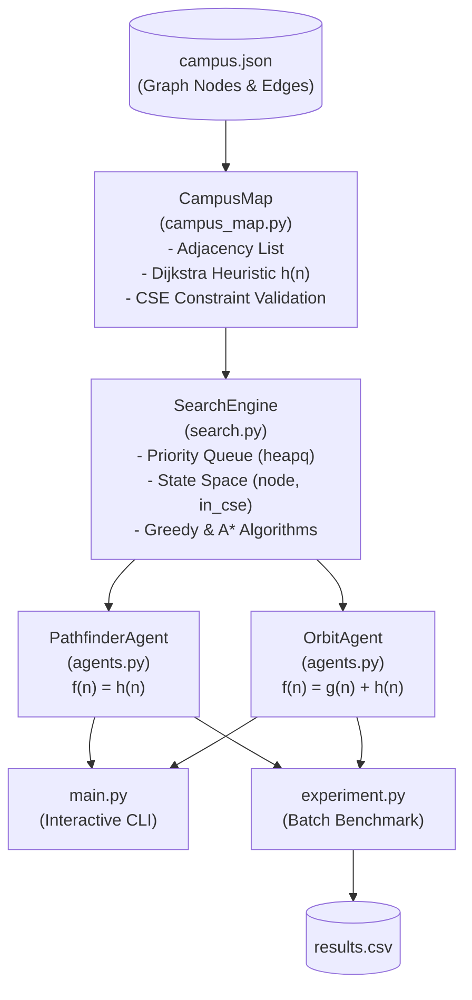
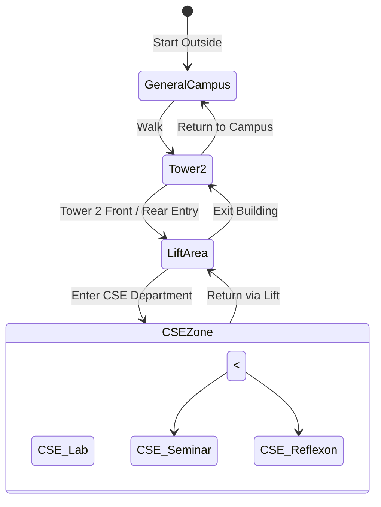

# 🧭 CU Tech Campus AI Route Navigator


[](https://www.python.org/)

[](#)

[](#)

[](#)

[](https://www.caluniv.ac.in/)

[](#)


> **Assignment X_03 | AI/ML Laboratory | B.Tech. 5th Semester**  

> **Problem Statement:** AI Campus Route Navigator  

> **Core Investigation:** *Does the path that looks closest to the destination also produce the best route?*


---


## 📖 Table of Contents

- [Project Overview](#-project-overview)

- [System Architecture](#-system-architecture)

- [Campus Graph Representation](#-campus-graph-representation)

  - [Location Codebook](#location-codebook)

  - [Map Connectivity & Graph Data](#map-connectivity--graph-data)

- [Search Algorithms & Agents](#-search-algorithms--agents)

  - [Agent 1: PATHFINDER (Greedy Best-First Search)](#agent-1-pathfinder-greedy-best-first-search)

  - [Agent 2: ORBIT (A* Search)](#agent-2-orbit-a-search)

  - [Heuristic Function Design](#heuristic-function-design)

- [Special Domain Rule: CSE Zone Routing Constraint](#-special-domain-rule-cse-zone-routing-constraint)

- [Project Structure](#-project-structure)

- [Prerequisites & Setup](#-prerequisites--setup)

- [Execution Instructions](#-execution-instructions)

  - [1. Interactive Mode (`main.py`)](#1-interactive-mode-mainpy)

  - [2. Automated Benchmarking (`experiment.py`)](#2-automated-benchmarking-experimentpy)

- [Experimental Results & Analysis](#-experimental-results--analysis)

  - [Benchmarking Results Table](#benchmarking-results-table)

  - [Key Analytical Observations](#key-analytical-observations)

- [Visual Demonstrations](#-visual-demonstrations)

- [Compliance with Assignment Constraints](#-compliance-with-assignment-constraints)

- [Academic Attribution](#-academic-attribution)


---


## 🎯 Project Overview


The **CU Tech Campus AI Route Navigator** is an autonomous graph search navigation system modeled after the real-world satellite layout of the **University of Calcutta (CU) Technology Campus**. 


The goal is to translate a satellite campus map into a weighted spatial graph and evaluate two distinct artificial intelligence search strategies:

1. **PATHFINDER** — Employs **Greedy Best-First Search**, continually expanding the node with minimal estimated distance to the destination.

2. **ORBIT** — Employs **A\* Search**, balancing the cumulative cost incurred so far with the heuristic estimate to ensure an optimal path.


Both agents navigate under physical campus path weights and strictly adhere to the **Special CSE Routing Rule**, which governs security and physical architectural flow into and out of Computer Science & Engineering facilities.


---


## 🏗 System Architecture


The project strictly adheres to Object-Oriented Programming (OOP) and Clean Architecture principles, completely decoupling the data schema, graph topology, search algorithms, routing agents, and interface layers:





---


## 🗺 Campus Graph Representation


The campus was converted into an undirected, weighted graph $G = (V, E, W)$, where:

- $V$: The exact set of physical locations visible on the official campus satellite map.

- $E$: Walkable paths between adjacent landmarks.

- $W$: Metric edge weights representing approximate walking distances (in meters).


### Location Codebook


The graph contains **21 unique nodes** strictly limited to the official campus map:


| Node Key | Full Campus Location Name | Landmark Category |

| :--- | :--- | :--- |

| `G1` | Entry Gate 1 (G1) | Campus Entrance |

| `G2` | Entry Gate 2 (G2) | Campus Entrance |

| `G3` | Entry Gate 2 (G3) | Campus Entrance |

| `G4` | Entry Gate 2 (G1) / College Street Gate | Campus Entrance |

| `Canteen` | Canteen, CU Technology Campus | Student Amenities |

| `Reception` | Reception of Calcutta University | Administrative |

| `PowerArea` | Power Area | Infrastructure |

| `Playground` | Playground of Technology Campus | Recreation |

| `Parking` | Parking Area | Infrastructure |

| `Tower2_Front` | tower 2 front entry | Building Access |

| `Tower2_Rear` | tower 2 rear entry | Building Access |

| `Library` | Library | Academic Facility |

| `GardenArea` | Garden Area Technology Campus | Open Ground |

| `Auditorium` | Auditorium Hall | Event Venue |

| `CRNN` | CRNN Centre (Nano Technology) | Research Centre |

| `NewBuilding1` | New Building 1 | Academic Building |

| `NewBuilding2` | New Building 2 (Workshop Building) | Academic/Workshop |

| `LiftArea` | Lift Area (Tower 2 Core) | CSE Zone Bottleneck |

| `CSE_Lab` | CSE Laboratory | Restricted CSE Zone |

| `CSE_Reflexon` | CSE Reflexon Room | Restricted CSE Zone |

| `CSE_Seminar` | CSE AKC Seminar Hall | Restricted CSE Zone |


### Map Connectivity & Graph Data


In accordance with assignment guidelines, all graph definitions are externalized in [`campus.json`](campus.json) rather than hardcoded.


```json

{

  "locations": {

    "G1": "Entry Gate 1 (G1)",

    "Canteen": "Canteen, CU Technology Campus",

    ...

  },

  "connections": [

    {"from": "G1", "to": "Canteen", "weight": 4},

    {"from": "G1", "to": "Auditorium", "weight": 10},

    {"from": "G1", "to": "G2", "weight": 35},

    ...

  ]

}

```


---


## 🧠 Search Algorithms & Agents


Both agents operate on an internal priority queue (`heapq`) frontier and explore states formatted as `(current_node, in_cse_zone)`.


### Agent 1: PATHFINDER (Greedy Best-First Search)

- **Evaluation Function**:

  $$f(n) = h(n)$$

- **Behavior**: Greedily explores whichever node currently appears closest to the target according to the heuristic estimate.

- **Characteristics**: Fast with minimal node expansion in straightforward paths; however, it is susceptible to suboptimal paths because it ignores the path cost already accrued ($g(n)$).


### Agent 2: ORBIT (A* Search)

- **Evaluation Function**:

  $$f(n) = g(n) + h(n)$$

  where:

  - $g(n)$ is the exact accumulated path cost from the start node to node $n$.

  - $h(n)$ is the estimated remaining distance from node $n$ to the goal.

- **Behavior**: Systematically trades off immediate closeness against historical path cost.

- **Characteristics**: Mathematically guaranteed to find the lowest-cost, optimal route whenever $h(n)$ is admissible (never overestimates true cost).


### Heuristic Function Design

The heuristic $h(n)$ in [`campus_map.py`](campus_map.py) calculates the unconstrained shortest physical path distance from node $n$ to the destination using Dijkstra's algorithm over the graph edge weights:

- **Admissibility**: Because the unconstrained shortest distance ignores the CSE boundary constraints and represents the minimum physical path length, $h(n) \le h^*(n)$ for all nodes $n$.

- **Consistency (Monotonicity)**: Satisfies the triangle inequality $h(n) \le c(n, a, n') + h(n')$, preventing repeated frontier re-expansions.


---


## 🚦 Special Domain Rule: CSE Zone Routing Constraint


The assignment mandates strict physical access rules (Part 7) modeling the real-world entry controls of the Computer Science & Engineering department:


### Designated CSE Locations

1. `CSE_Lab` (CSE Laboratory)

2. `CSE_Seminar` (CSE AKC Seminar Hall)

3. `CSE_Reflexon` (CSE Reflexon Room)


### The Constraint Protocol

To enter any CSE-labelled room, the path must follow:

$$\text{Tower 2 Front/Rear Entry} \longrightarrow \text{Lift Area} \longrightarrow \text{CSE-labelled Location}$$


1. **Entry Rule**: You cannot reach any CSE location directly from the outside without passing through `Lift Area`.

2. **Containment Rule**: Once `Lift Area` has been crossed into the CSE zone, **only** CSE-labelled locations may be visited until the agent returns through `Lift Area`.

3. **Exit Rule**: To return to general campus locations, the agent must backtrack:

$$\text{CSE Location} \longrightarrow \text{Lift Area} \longrightarrow \text{Tower 2 Front/Rear Entry} \longrightarrow \text{Other Campus Locations}$$

4. **Invalid Transitions**: Any path such as $\text{Lift Area} \rightarrow \text{CSE Laboratory} \rightarrow \text{GardenArea} \rightarrow \text{Library}$ is strictly rejected by the neighbor generation engine.





---


## 📁 Project Structure


```

CU_Tech_Campus_Navigator/

│

├── campus.json            # Graph definition: 21 nodes, 28 weighted edges

├── campus_map.py          # CampusMap class: loads JSON, computes h(n), enforces CSE rules

├── search.py              # SearchEngine class: priority queue implementations of Greedy & A*

├── agents.py              # OOP Agents: PathfinderAgent and OrbitAgent abstractions

├── experiment.py          # Batch experiment suite; writes outputs to results.csv

├── main.py                # Interactive CLI navigation interface

├── results.csv            # Benchmarked experimental records

├── screenshots/           # Evidence of CLI test runs and validation

│   ├── Screenshot 2026-10-01 214055.png

│   ├── Screenshot 2026-10-01 214121.png

│   ├── Screenshot 2026-10-01 214147.png

│   └── Screenshot 2026-10-01 214218.png

└── README.md              # Comprehensive project documentation

```


---


## ⚙️ Prerequisites & Setup


### Requirements

- **Python**: Version `3.8` or higher

- **Dependencies**: **Zero external packages required!** The project relies entirely on the Python Standard Library (`json`, `heapq`, `time`, `csv`).


### Installation

Clone the repository to your local machine:

```bash

git clone https://github.com/aritrachakraborty2909-hub/CU_Tech_Campus_Navigator.git

cd CU_Tech_Campus_Navigator

```


Verify your Python installation:

```bash

python --version

```


---


## 🚀 Execution Instructions


### 1. Interactive Mode (`main.py`)

Run the interactive console program to input custom start and destination locations:


```bash

python main.py

```


#### Step-by-Step CLI Walkthrough

1. When launched, the terminal displays all available 21 campus locations with their corresponding key codes.

2. Enter the **starting location code** (e.g., `G1`).

3. Enter the **destination location code** (e.g., `CRNN`).

4. The system runs both **PATHFINDER** and **ORBIT** simultaneously and displays:

   - Full chosen route

   - Total path cost (in meters)

   - Number of nodes explored

   - Execution time (in seconds)


#### Sample Output:

```text

--- Available Campus Map Locations ---

[G1]: Entry Gate 1 (G1)

[G2]: Entry Gate 2 (G2)

[G3]: Entry Gate 2 (G3)

[G4]: Entry Gate 2 (G1)

[Canteen]: Canteen, CU Technology Campus

[Reception]: Reception of Calcutta University

[PowerArea]: Power Area

[Playground]: Playground of Technology Campus

[Parking]: Parking Area

[Tower2_Front]: tower 2 front entry

[Tower2_Rear]: tower 2 rear entry

[Library]: Library

[GardenArea]: Garden Area Technology Campus

[Auditorium]: Auditorium Hall

[CRNN]: CRNN Centre (Nano Technology)

[NewBuilding2]: New Building 2 (Workshop Building)

[NewBuilding1]: New Building 1

[LiftArea]: Lift Area

[CSE_Lab]: CSE Laboratory

[CSE_Reflexon]: CSE Reflexon Room

[CSE_Seminar]: CSE AKC Seminar Hall

---------------------------------------


Enter starting location code: G1

Enter destination location code: CRNN


=============================================

PATHFINDER (Greedy Best-First Search)

Route: G1 -> Auditorium -> CRNN

Cost: 17 m

Nodes explored: 3

Time: 0.000434 s


ORBIT (A* Search)

Route: G1 -> Canteen -> Reception -> CRNN

Cost: 12 m

Nodes explored: 4

Time: 0.000148 s

=============================================

```


---


### 2. Automated Benchmarking (`experiment.py`)

Run the batch benchmarking script to test multiple predefined pairs (both general campus routes and CSE-constrained routes):


```bash

python experiment.py

```


#### Execution Output:

```text

Experiments logged to results.csv successfully.

```

This automatically produces or updates [`results.csv`](results.csv).


---


## 📊 Experimental Results & Analysis


### Benchmarking Results Table


Below is the experimental data recorded in [`results.csv`](results.csv) across multiple test cases:


| Source | Destination | Agent | Generated Path | Cost ($m$) | Nodes Explored | Exec Time ($s$) |

| :--- | :--- | :--- | :--- | :---: | :---: | :---: |

| **Reception** | **Library** | PATHFINDER | Reception $\rightarrow$ PowerArea $\rightarrow$ Playground $\rightarrow$ Parking $\rightarrow$ Tower2_Rear $\rightarrow$ Library | 27 | 6 | 0.000147 |

| **Reception** | **Library** | ORBIT (A*) | Reception $\rightarrow$ PowerArea $\rightarrow$ Playground $\rightarrow$ Parking $\rightarrow$ Tower2_Rear $\rightarrow$ Library | 27 | 6 | 0.000291 |

| **Canteen** | **NewBuilding2** | PATHFINDER | Canteen $\rightarrow$ G1 $\rightarrow$ Auditorium $\rightarrow$ NewBuilding2 | 21 | 4 | 0.000100 |

| **Canteen** | **NewBuilding2** | ORBIT (A*) | Canteen $\rightarrow$ G1 $\rightarrow$ Auditorium $\rightarrow$ NewBuilding2 | 21 | 4 | 0.000093 |

| **GardenArea** | **G4** | PATHFINDER | GardenArea $\rightarrow$ G4 | 18 | 2 | 0.000362 |

| **GardenArea** | **G4** | ORBIT (A*) | GardenArea $\rightarrow$ NewBuilding1 $\rightarrow$ G3 $\rightarrow$ G4 | **17** | 4 | 0.000284 |

| **G1** | **CRNN** | PATHFINDER | G1 $\rightarrow$ Auditorium $\rightarrow$ CRNN | 17 | 3 | 0.000434 |

| **G1** | **CRNN** | ORBIT (A*) | G1 $\rightarrow$ Canteen $\rightarrow$ Reception $\rightarrow$ CRNN | **12** | 4 | 0.000148 |

| **Library** | **Canteen** | PATHFINDER | Library $\rightarrow$ Tower2_Rear $\rightarrow$ Parking $\rightarrow$ Playground $\rightarrow$ PowerArea $\rightarrow$ Reception $\rightarrow$ Canteen | 31 | 7 | 0.000105 |

| **Library** | **Canteen** | ORBIT (A*) | Library $\rightarrow$ Tower2_Rear $\rightarrow$ Parking $\rightarrow$ Playground $\rightarrow$ PowerArea $\rightarrow$ Reception $\rightarrow$ Canteen | 31 | 7 | 0.000102 |


---


### 🔬 Key Analytical Observations


Addressing the core research questions outlined in Part 9 of the assignment:


#### 1. Does Greedy Best-First always find the shortest route?

> **Answer: No.**  

> As demonstrated in the `G1` $\rightarrow$ `CRNN` query:

> - **PATHFINDER** greedily moved towards `Auditorium` because its estimated distance to `CRNN` looked lower, producing a path length of **17 m**.

> - **ORBIT** evaluated the cumulative distance and discovered the path through `Canteen -> Reception -> CRNN` with a total cost of **12 m**.  

> Similarly, for `GardenArea` $\rightarrow$ `G4`, PATHFINDER chose a direct edge of **18 m**, whereas ORBIT found the shorter segmented detour through `NewBuilding1 -> G3 -> G4` totaling **17 m**.


#### 2. How does A* use the distance already travelled?

> **Answer:**  

> A\* maintains an explicit path cost accumulator $g(n)$. If a candidate path accumulates high edge costs early on, its evaluation $f(n) = g(n) + h(n)$ increases, allowing the priority queue to deprioritize it in favor of alternative, lower-cost partial paths even if their heuristic values are slightly larger.


#### 3. When do the two agents choose different paths?

> **Answer:**  

> The agents diverge when an edge that appears promising (lower $h(n)$) has a high physical edge cost, or when taking a series of shorter intermediate hops yields a lower total sum than a single direct link. Greedy commits early to local minima, whereas A\* explores globally optimal paths.


#### 4. How does the heuristic affect their behaviour?

> **Answer:**  

> The heuristic guides the frontier expansion. For Greedy Best-First, $h(n)$ is the sole driver, enabling fast execution with few node expansions at the expense of optimality. For A\*, an admissible heuristic acts as a directional compass, pruning unpromising branches while preserving the optimality guarantee.


#### 5. What happens when the CSE constraint restricts possible routes?

> **Answer:**  

> The constraint limits state validity. Paths cannot cross into the CSE zone without passing through `LiftArea`. Any state transition attempting to bypass the `LiftArea` bottleneck is invalidated, forcing the search frontier to discover valid entry and exit corridors.


---


## 📷 Visual Demonstrations


The following terminal screenshots demonstrate live program execution:


| Test Scenario | Terminal Output Screenshot |

| :--- | :--- |

| **Heuristic Divergence: `G1` to `CRNN`**<br>PATHFINDER chooses 17m route; ORBIT identifies optimal 12m route. |  |

| **Detour Optimality: `GardenArea` to `G4`**<br>PATHFINDER takes direct 18m edge; ORBIT discovers 17m path via NewBuilding1. |  |

| **Input Code Validation**<br>Graceful handling and warning when invalid location codes are entered. |  |

| **CSE Zone Routing Rule Evaluation**<br>Testing access restrictions into the Computer Science & Engineering department. |  |


---


## 📋 Compliance with Assignment Constraints


| Assignment Requirement (Page 6) | Status | Project Implementation |

| :--- | :---: | :--- |

| Use only nodes shown in the provided map | ✅ | 21 nodes verified directly from satellite map |

| Construct your own graph | ✅ | Fully modeled with 28 weighted edges |

| Assign reasonable connectivity and weights | ✅ | Metric distances approximated in meters |

| Implement Greedy Best-First Search ($f = h$) | ✅ | Custom `SearchEngine` with priority queue |

| Implement A\* Search ($f = g + h$) | ✅ | Custom `SearchEngine` with path cost accumulation |

| Implement an admissible heuristic | ✅ | Dijkstra geodesic shortest distance estimate |

| Implement the CSE-zone constraint | ✅ | Enforced via `is_valid_transition()` and state tracking |

| External file handling for campus graph | ✅ | Stored and loaded from `campus.json` |

| Record experimental results to CSV | ✅ | Automated benchmark exporter writes `results.csv` |

| OOP architecture across multiple files | ✅ | Modularized across 6 dedicated files |

| **No external pathfinding libraries** | ✅ | Zero third-party dependencies used (`heapq` only) |

| **No hard-coded final routes** | ✅ | Routes computed dynamically at runtime |


---


## 🎓 Academic Attribution


- **Course**: B.Tech. in Computer Science & Engineering (5th Semester)

- **Subject**: Artificial Intelligence & Machine Learning Laboratory

- **Assignment**: Assignment X_03 — AI Campus Route Navigator

- **Institution**: University of Calcutta (Technology Campus)

- **Author**: Saikat sarkar ([@saikat-sarkar19](https://github.com/saikat-sarkar19))
